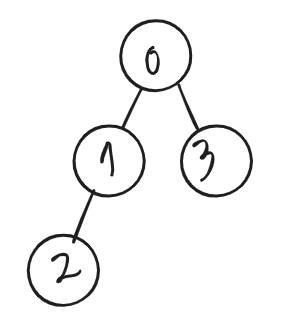

### 환경: mac OS Mojave 10.14, CLion

우리는 프로그래밍언어로 문제를 해결하거나 새로운 기능을 만들 때, 알고리즘을 설계합니다.

알고리즘을 코드로 구현할때 구현한 프로그램이 효과적으로( 빠른시간 안에 동작 || 적은 데이터를 사용하여 ) 동작할 수 있게

많이 알려진 자료구조를 사용하는데, 문제 상황에 맞게 자료구조를 선택하여 구현하면 됩니다.

Binary Tree을 설명하고, 이진트리를 어떻게 표현하는지 쓰는지에 대해서 그림으로 이해해보고, 이진트리를 이용한 이진트리 순회를 슈도코드로 작성하겠습니다.

## Binary Tree 개념:
Binary Tree는 다음과 같이 모형을 가진 자료구조입니다.

[Tree]()에 대한 내용은 링크를 통해 보시길 바랍니다.

자식이 두개 이하인 트리를 이진트리라고 하는데요.

이진트리는 이진 검색트리, 완전 이진트리, 포화 이진트리등 다양한 구조들이 있습니다.
  
[참조: 혼자연구하는 C/C++](http://soen.kr/lecture/ccpp/cpp2/19-5-2.htm)

이진트리도 여러가지 방법으로 구현할 수 있겠지만
2차원배열을 기준으로 설명하겠습니다.


  
위와 같은 이진트리를 2차원배열로 표현하면 다음과 같아집니다.

 


혹시 인접리스트가 뭔지 모르시겠다면 [여기](https://sarah950716.tistory.com/12)서 설명을 잘해주셨으니 참고하시길.

이진트리에서 특히 완전 이진트리는 힙(우선순위큐는 힙으로 구현됌)으로 사용되는데요.
힙이라는 자료구조를 쉽고, 효율적이기 때문에 많이 사용하는 자료구조입니다. 이진트리를 알면 힙을 이해할때도 이진트리는 도움이 됩니다.

이진트리 순회 대표적인 3가지 중위,전위,후위 순회의 슈도코드를 작성해보겠습니다.  
중위, 전위, 후위로 나누는 기준은 방문 순서입니다.  
왼쪽자식방문하고 현재노드찍고 오른쪽자식방문하면 중위순회  
현재노드찍고 왼쪽자식방문 오른쪽자식방문하면 전위순회 이런 식입니다.

2차원배열로 구현하기 때문에  
왼쪽자식의 노드번호를 tree[현재노드][0]에 저장,  
오른쪽자식 노드번호를 tree[현재노드][1]에 저장하여 이진트리를 표현하겠습니다.  
 
다시말해서 tree[노드개수][2] 로 표현할 수 있습니다.
그리고 구현의 편의를 위해 tree배열을 -1로 초기화 한다면, 자식이 없는 경우를 표현할 수 있습니다.

## 중위순회 슈도코드
```
중위순회(루트노드)

중위순회(현재노드){
    if(현재노드)
        종료
    중위순회(왼쪽자식);
    현재노드 출력 혹은 방문 표시
    중위순회(오른쪽자식);
}
```

## 전위순회 슈도코드
```
전위순회(루트노드)

전위순회(현재노드){
    if(현재노드)
        종료
    
    현재노드 출력 혹은 방문 표시
    전위순회(왼쪽자식);
    전위순회(오른쪽자식);
}
```

## 후위순회 슈도코드
```
전위순회(루트노드)

전위순회(현재노드){
    if(현재노드)
        종료
    
    후위순회(왼쪽자식);
    후위순회(오른쪽자식);
    현재노드 출력 혹은 방문 표시
}
```