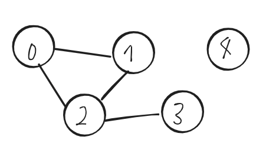
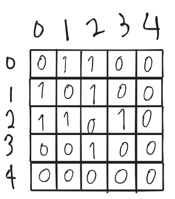
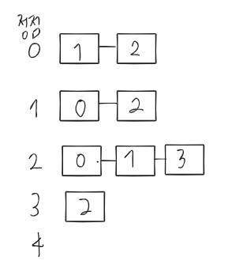
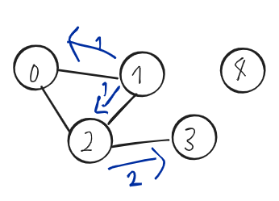
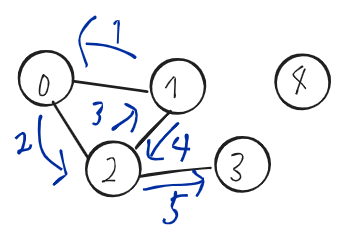

### 환경: mac OS Mojave 10.14, CLion

우리는 프로그래밍언어로 문제를 해결하거나 새로운 기능을 만들 때, 알고리즘을 설계합니다.

알고리즘을 코드로 구현할때 구현한 프로그램이 효과적으로( 빠른시간 안에 동작 || 적은 데이터를 사용하여 ) 동작할 수 있게

많이 알려진 자료구조를 사용하는데, 문제 상황에 맞게 자료구조를 선택하여 구현하면 됩니다.

Graph을 설명하고, 그래프를 어떻게 표현하는지 그림으로 이해해보고, 그래프 탐색 알고리즘을 슈도코드로 작성하겠습니다.

## Graph 개념:
Graph는 
다음과 같이 모형을 가진 자료구조입니다.



Graph는 정점과 간선들의 묶음으로 데이터를 표현하는 자료구조입니다.

이해를 돕기 위해서 2차원 배열을 생각해보겠습니다.

그래프로 설계한 알고리즘을 구현할때 크게 2가지 방법으로 그래프를 구현합니다.

인접 리스트 (위 그래프를 표현)



인접 배열 ( 위 그래프를 표현)



두 방식은 각각의 장단점이 있습니다. 상황에 맞게 사용하면 됩니다.

인접 배열은 2차원 배열
인접 리스트는 1차원 배열에 리스트가 들어간 형태로 구현할 수 있습니다.

각각의 공간복잡도는 
인접 배열 (정점개수^2)
인접 리스트 (간선개수)

그래프를 탐색하는 방법
크게 두가지 있습니다.
DFS, BFS 입니다.
이 두 탐색방법의 목적은 "모든 연결된 노드를 한 번씩 방문"하는 겁니다.

그래프탐색은
인접배열을 기반으로 하겠습니다.

DFS (깊이 우선 탐색)


## DFS 슈도코드
```
DFS(탐색을 시작할 노드)

DFS(현재 노드){
    현재노드 방문 표시
    
    for(현재 노드에서 연결된 노드들을 순회)
        if(이동할 노드를 이전에 방문했는가?)
            continue;
        DFS(이동할 노드)    
}
```

BFS (너비 우선 탐색)



## 슈도코드
```
BFS(탐색을 시작할 노드)

BFS(현재 노드){
    현재 노드 방문 표시
    큐에 현재 노드 push
    
    while(큐가 안비었으면){
        현재 노드 = 큐에서 맨앞에꺼를 뺀다.
        for(현재노드에서 연결된 노드들 순회)
            if(이동할 노드를 이전에 방문했는가?)
                continue;
            
            이동할 노드 방문 표시
            큐에 이동할 노드 push
        
    }
}

```
