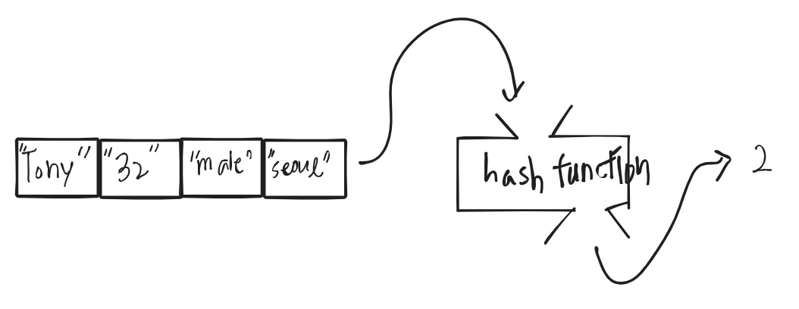
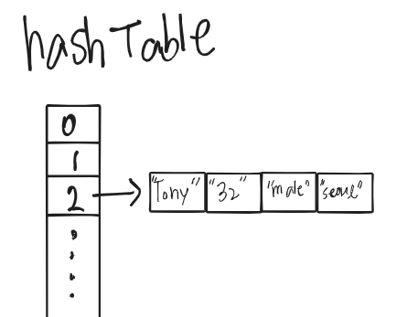

### 환경: mac OS Mojave 10.14, CLion

우리는 프로그래밍언어로 문제를 해결하거나 새로운 기능을 만들 때, 알고리즘을 설계합니다.

알고리즘을 코드로 구현할때 구현한 프로그램이 효과적으로( 빠른시간 안에 동작 || 적은 데이터를 사용하여 ) 동작할 수 있게

많이 알려진 자료구조를 사용하는데, 문제 상황에 맞게 자료구조를 선택하여 구현하면 됩니다.

HashTable의 개념을 설명하고, HashTable이 어떤 구조인지 그림으로 이해해보고, 해쉬를 구현하는 알고리즘을 슈도코드로 작성하겠습니다.

## HashTable 개념:
HashTable은 저장할 데이터를 Hashing 함수의 입력으로 넣고 해싱함수의 리턴된 결과값(해싱값)과 데이터를 (key: value) 형태로 매핑해놓은 배열 또는 리스트 배열입니다.

보통 HashMap이란 유명한 자료구조입니다.

해쉬함수의 리턴값은 항상 0~해쉬테이블의 크기-1 사이에 값으로 고정되어있습니다. 리턴된 값을 해쉬테이블의 인덱스로 사용하기 위함입니다.

왜 이렇게 복잡한 연산을 수행하면서 데이터를 저장하느냐?
데이터 삽입, 삭제, 탐색 연산이 O(1)에 가능하기 때문입니다.
엄밀히 말하면 해싱값 충돌시 체이닝을 통해 데이터를 저장할 것이기 때문에   
시간복잡도는 O( 1 + 체이닝 데이터 수 ) 될 것입니다.

우리는 배열이란 자료구조에 데이터를 저장해놓고, 데이터의 인덱스만 알면 그 데이터를 참조하는데 걸리는 시간복잡도는 O(1) 됩니다.

이런 꿈같은 얘기를 해쉬함수가 가능하게 해줍니다.






물론 해쉬함수가 locality를 보장해주지 않기 때문에 탐색이 많아지면 결국 선형 시간을 갖을 것이지만  
모든 자료구조가 그렇듯 상황에 맞게 효과적으로 사용하면 되는 것 입니다.

물론 해쉬에는 신경써야할 부분들이 많습니다. 해싱값 충돌 해결법이나, 해싱값의 클러스터링 등등 있겠지만,  
우선 해쉬를 먼저 사용에 익숙해지고, 해쉬에 시간복잡도를 신경써야할 때에 더 자세한 부분을 찾아보는게 맞다고 생각합니다.


## 해쉬구현 슈도코드
```
해시테이블을 위한 Array(n) 정적 크기 배열 생성
for( 0 ~ n-1 )
    해시테이블[i] = 동적배열 Array() 생성

해싱함수(입력){
    출력=해싱연산
    0~n-1사의 출력값을 리턴
}

삽입함수(입력){
    임시값 = 해싱함수(입력)
    해시테이블[임시값].push(입력);
}

삭제함수(입력){
    임시값 = 해싱함수(입력)
    for( 0~ 해싱테이블[임시값].length-1)
        if( 해싱테이블[임시값][i] === 입력값)
            해싱테이블[임시값][i] 제거
            종료
    
}

탐색함수(){
    임시값 = 해싱함수(입력)
    for( 0~ 해싱테이블[임시값].length-1)
        if( 해싱테이블[임시값][i] === 입력값)
            해싱테이블[임시값][i] 반환
            종료
}


```
