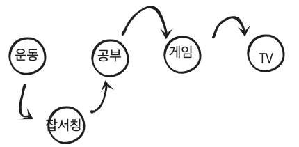

### 환경: mac OS Mojave 10.14, CLion

우리는 프로그래밍언어로 문제를 해결하거나 새로운 기능을 만들 때, 알고리즘을 설계합니다.

알고리즘을 코드로 구현할때 구현한 프로그램이 효과적으로( 빠른시간 안에 동작 || 적은 데이터를 사용하여 ) 동작할 수 있게

많이 알려진 자료구조를 사용하는데, 문제 상황에 맞게 자료구조를 선택하여 구현하면 됩니다.

LinkedList을 설명하고, 스택을 왜 쓰는지에 대해서 그림으로 이해해보고, 스택을 이용한 알고리즘을 슈도코드로 작성하겠습니다.

## LinkedList 개념:
LinkedList은 각각의 데이터가 링크로 이어져 있는 데이터 저장 공간입니다.

첫번째 데이터 또는 마지막 데이터의 주소를 기억해야하는 구조입니다.

그래야 첫번째 데이터 또는 마지막 데이터를 시작으로 링크를 타고 다니면서 순회를 할 수 있습니다.


우선순위를 통해 일을 처리하기 위해 TodoList를 구현하려고 합니다.

자료구조로는 쌩뚱맞게 Array를 사용하겠습니다. 
Array에 보다 LinkedList가 더 효과적인 상황을 만들어서 LinkedList를 쓰면 어떻게 좋은지 알아보겠습니다.

1.  운동1시간
2.  공부1분
3.  게임1시간
4.  TV2시간

이렇게 리스트가 있을때 우선순위를 변경하고 싶어졌습니다.
2번 위치에 잡서칭1시간을 추가하고싶은데요. 

Array는 같은 자료형을 가진 메모리 공간으로 이루어진 자료구조이고, 장점으로는 인덱스를 통해 O(1)복잡도로
해당 데이터를 접근할 수 있는 자료구조입니다.

첫번째 인덱스 1번~n번까지 TodoList개수만큼 순회를 합니다.
2번을 찾았으면 이번에 잡서칭1시간을 추가하기 위해 공간을 마련해야합니다.
공부1분을 3번으로 이동시키고, 게임1시간을 4번으로, TV2시간을 5번으로 이동시킨 후
마련된 2번 공간에 잡서칭1시간을 저장하면 됩니다.

Array의 단점은 중간에 값을 삽입하기 위해서는 최악의 경우 O(n) 이란 시간복잡도를 갖습니다.
잡서칭1시간을 특정위치에 저장하기 위해서 2~4번 할일을 미뤘습니다. 총 3번의 이동이란 기회비용이 들었습니다.

## LinkedList를 쓰면 좋은점


LinkedList를 사용한다면 잡서칭 1시간을 1번 다음 링크에 붙이고 2번 이전 링크에 붙이면 됩니다.
이렇게 되면 데이터를 중간에 삽입하는데 걸리는 시간복잡도는 O(1)이 됩니다.


## 슈도코드
```
링크드 리스트를 생성합니다.
운동 1시간을 추가합니다.
공부 1분을 운동 1시간 뒤에 추가합니다.
게임 1시간을 공부 1분 뒤에 추가합니다.
TV 2시간을 게임 1시간 뒤에 추가합니다.
잡서칭 1시간을 운동 뒤에 공부 1분 이전에 추가합니다.

```
