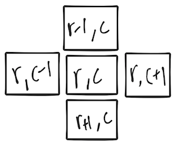
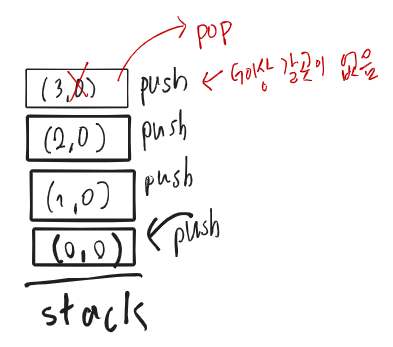

### 환경: mac OS Mojave 10.14, CLion

우리는 프로그래밍언어로 문제를 해결하거나 새로운 기능을 만들 때, 알고리즘을 설계합니다.

알고리즘을 코드로 구현할때 구현한 프로그램이 효과적으로( 빠른시간 안에 동작 || 적은 데이터를 사용하여 ) 동작할 수 있게

많이 알려진 자료구조를 사용하는데, 문제 상황에 맞게 자료구조를 선택하여 구현하면 됩니다.

STACK을 설명하고, 스택을 왜 쓰는지에 대해서 그림으로 이해해보고, 스택을 이용한 알고리즘을 슈도코드로 작성하겠습니다.

## 스택 개념:
STACK은 LIFO (Last In First Out)구조의 데이터를 저장할 수 있는 공간입니다.

데이터를 저장하고, 최근에 저장한 데이터를 확인할 수 있고, 데이터를 빼낼 때는 최근에 추가된 것을 빼냅니다.

각 위치에서 이동할 수 있는 방향으로는 현재 위치를 (r,c) 이라할때     


위와 같이 표현할 수 있고 각 (r,c) 남, 동, 북, 서 방향으로 순서대로 이동할 수 있다고 가정합니다. (x표시나, 배열 범위를 넘어갈 수 없음.)


위와 같은 2차원 배열 구조의 격자판에서 x 로 되어있거나 배열 범위를 넘어가지 않은 상태에서

(행, 열)기준으로 (0,0) -> (3,3)으로 이동하는 프로그램을 스택을 통해 구현할 수 있습니다.

## 스택을 쓰면 좋은점

이렇게 격자판에서 도착지점을 가기 위해 스택에 이동공간을 저장합니다.


그런데 막 다른 곳에서는 갈 곳이 없을때는 돌아와야 하는데 스택에 이동한 공간을 저장 해놓았기 때문에

최근에 이동한 곳으로 돌아갈 수 있습니다. 이렇게 발자취를 기억해야하는 상황에서 스택은 유용하게 쓰일 수 있는 자료구조입니다.

이렇게 스택이란 자료구조를 통해 다음과 같이 스택을 이용해서

2차원 배열에서 (0,0) -> (3,3) 시작위치와 도착위치를 정해주면 이동할 수 있는지 없는지 판단할 수 있는 프로그램을 구현할 수 있습니다.


## 슈도코드
```
스택을 생성한다.
시작 공간을 입력받는다.
스택에 시작 위치을 저장한다.

while(true){
    최근에 저장한 이동 위치를 확인한다.
    
    if(최근 이동 위치가 도착 위치면)
        도착했음을 저장 또는 출력.
        종료.
    
    for(북 남 동 서){
        이동할 수 있는지 체크한다.
        이동할 수 있으면 스택에 이동 위치를 저장한다.
    }
}

```
