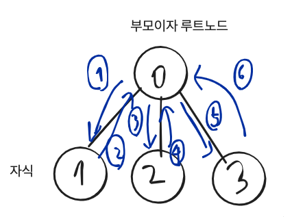

### 환경: mac OS Mojave 10.14, CLion

우리는 프로그래밍언어로 문제를 해결하거나 새로운 기능을 만들 때, 알고리즘을 설계합니다.

알고리즘을 코드로 구현할때 구현한 프로그램이 효과적으로( 빠른시간 안에 동작 || 적은 데이터를 사용하여 ) 동작할 수 있게

많이 알려진 자료구조를 사용하는데, 문제 상황에 맞게 자료구조를 선택하여 구현하면 됩니다.

Tree을 설명하고, 트리를 어떻게 표현하는지에 대해서 그림으로 이해해보고, 트리를 이용한 알고리즘을 슈도코드로 작성하겠습니다.

## Tree 개념:
Tree는 다음과 같이 모형을 가진 자료구조입니다.


[참조: 생활코딩](https://opentutorials.org/course/1375/6698)


Tree는 Graph와 같이 정점(노드)과 간선으로 이뤄졌습니다.

거기에 상하 계층 개념이 추가됩니다. <span style="color:red">부모 자식</span>간의 관계가 형성됩니다.

그리고 모든 트리의 꼭대기를 루트 노드라고 합니다.


위와 같은 트리가 있다고 해봅시다.


인접 리스트는 1차원 리스트 배열을 이용해 구현할 수 있습니다. (물론 다양한 방법들이 있지만 인접리스트로 구현해봄.)


인접리스트 공간복잡도는 

인접 리스트 (간선개수)

여러가지 방법으로 트리를 표현할 수 있다는 점.

이제 트리를 순회(탐색)하는 알고리즘을 슈도코드로 작성해보겠습니다.

## 트리순회 슈도코드
```
트리순회(루트노드)

트리순회(현재노드){
    for(현재노드에서 연결된 노드들 순회)
        if(연결된 노드를 아직 방문 안했는가?)
           연결된 노드를 방문표시
           중위순회(연결된 노드)       
}

```
트리 순회를 시뮬레이션한 그림


함수호출

1) 0 -> 1 재귀호출
2) 1 -> 0 재귀에서 돌아옴.
3) 0 -> 2 재귀호출
4) 2 -> 0 재귀에서 돌아옴.
5) 0 -> 3 재귀호출
6) 3 -> 0 재귀에서 돌아옴.

함수종료


방문 표시를 위한 정점(노드)의 개수만큼의 배열이 필요합니다.
