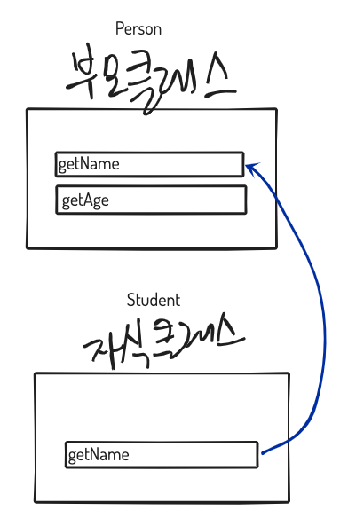

### 환경: mac OS Mojave 10.14, CLion

# class 키워드와 super 키워드를 이용해 객체 지향적 프로그래밍을 구현해보자!

## 추가 예정인 내용
getter, setter, static property, static method

## class키워드 
ES5에서는 생성자 함수와 프로토타입, 클로저를 사용하여 객체 지향 프로그래밍을 구현.

```javascript
// ES5
var Person = function () {
  //Constructor
  function Person(name) {
    this._name = name;
  }

  //method
  Person.prototype.sayHi = function () {
    console.log('Hi! ' + this._name);
  };

  //
  return Person;
};

//인스턴스 생성
var me = new Person('Noh');
me.sayHi(); // Hi! Noh.

console.log(me instanceof Person); // true

```

ES6에서는 class키워드를 사용하여 정의함.
좀더 자바나 c++언어에서 클래스를 정의한 것과 비슷한 형태와 비슷해짐.  
프로퍼티들은 constructor {} 블럭 안에 넣어야함.
```javascript

class Person {
  constructor(name) {
    this._name = name;
  }

  sayHi() {
    console.log(`Hi! ${this._name}`);
  }
}

// 인스턴스 생성
const me = new Person('Noh');
me.sayHi(); // Hi! Noh

console.log(me instanceof Person); // true
```

## super키워드
extends 키워드에 대해서 선행학습이 필요하다. -> class 상속 개념 -> class 개념  
순으로 모르는 개념이 있다면 화살표 끝부터 다시 돌아오는 식으로 이해함.  
[poiemaweb](https://poiemaweb.com/es6-class)에서 부족한 부분을 이해하면 됌.  

짧게 말하자면  
super()는?   
부모 클래스의 constructor()를 호출한다. === 부모 클래스의 인스턴스를 생성한다.    
또한, 자식 클래스의 constructor에서 super를 호출하지 않으면 this에 대한 참조 에러가 발생함.    

부모클래스인(Person)와 자식클래스(Student)가 있다.  

```javascript
class Student extends Person{
    constructor(학번, 이름, 나이){
        super(이름, 나이);
        this.학번 = 학번;
    }
    
    // Student 클래스는 Person 클래스의 메소드를 그대로 사용하거나
    // 덮어씌울 수 있다. Student 인스턴스에서 덮어씌운 메서드를 호출시
    // 부모클래스 메소드 getName이 아닌 자식 클래스 메소드 getName이 호출됌
    getName() {
        //부모 클래스 메소드인 getName을 덮어씌움
        return `학번:${this.학번}, 이름:${this.이름} ...입니다`;
    }
}

```


